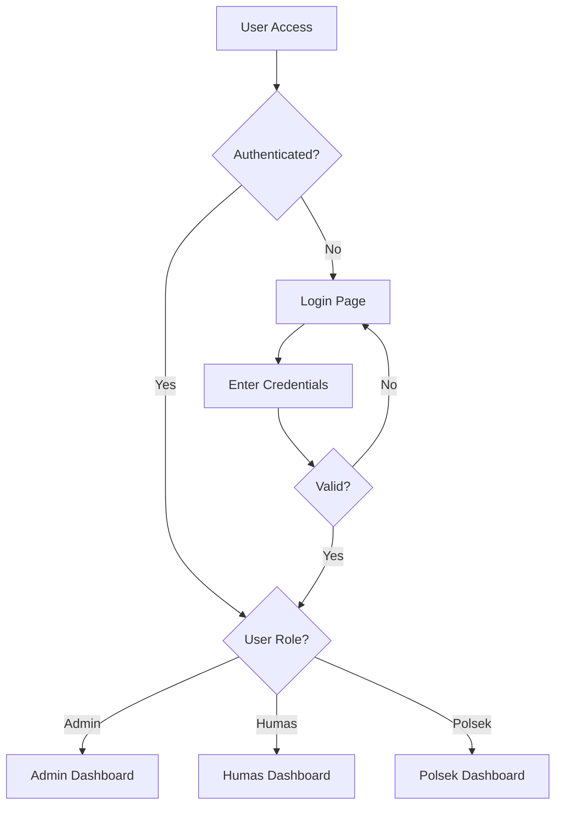

# 🚔 SPLD-Client

<div align="center">


**Sistem Pendataan Laporan dan Dokumentasi**  
_A comprehensive report and documentation management system_

[](https://reactjs.org/)
[](https://vitejs.dev/)
[](https://tailwindcss.com/)
[](https://redux-toolkit.js.org/)

[🚀 Live Demo](https://spld-client.vercel.app) • [📖 Documentation](#-api-documentation) • [🐛 Report Bug](https://github.com/LVNVoid/SPLD-Client/issues) • [✨ Request Feature](https://github.com/LVNVoid/SPLD-Client/issues)

</div>

---

## 📋 Table of Contents

- [🎯 About The Project](#-about-the-project)
- [✨ Features](#-features)
- [🛠️ Built With](#️-built-with)
- [🚀 Getting Started](#-getting-started)
  - [Prerequisites](#prerequisites)
  - [Installation](#installation)
- [💻 Usage](#-usage)
- [🗺️ Routing](#️-routing)
- [📚 API Documentation](#-api-documentation)
- [🎨 Screenshots](#-screenshots)
- [🤝 Contributing](#-contributing)
- [📄 License](#-license)
- [📞 Contact](#-contact)

---

## 🎯 About The Project

**SPLD-Client** is a modern, responsive web application designed to streamline the report and documentation management process for Polres Magelang. The system facilitates efficient collection of reports from Polsek (police sectors) to Humas (public relations), enabling organized publication of activity narratives with full transparency.

### 🎪 What Makes SPLD Special?

- **🔐 Secure Authentication** - Role-based access control for different user types
- **📊 Intuitive Dashboard** - Real-time metrics and quick action buttons
- **📝 Smart Report Management** - Create, edit, and track reports seamlessly
- **📖 Narrative Publishing** - Transform reports into engaging public narratives
- **👥 User Role Management** - Granular permission controls
- **🌙 Theme Support** - Light and dark mode for better user experience
- **📱 Responsive Design** - Works perfectly on all devices

---

## ✨ Features

<table>
<tr>
<td width="33%">

### 🔒 **Authentication & Security**

- Secure JWT-based login system
- Role-based access control (Admin, Humas, Polsek)
- Protected routes and unauthorized access handling
- Session management with auto-logout

</td>
<td width="33%">

### 📊 **Dashboard & Analytics**

- Real-time key metrics overview
- Quick action buttons for common tasks
- Visual data representation
- Activity tracking and notifications

</td>
<td width="33%">

### 📝 **Content Management**

- Rich text report creation and editing
- Image upload with preview functionality
- Narrative publishing system
- Version control and audit trails

</td>
</tr>
<tr>
<td width="33%">

### 👥 **User Management**

- Comprehensive user role administration
- Polsek data management
- User activity monitoring
- Profile management system

</td>
<td width="33%">

### 🌐 **Public Interface**

- Publicly accessible narratives
- Contact and about us pages
- SEO-optimized content delivery
- Accessibility compliant design

</td>
<td width="33%">

### 🎨 **User Experience**

- Modern, intuitive interface
- Light and dark theme options
- Smooth animations with Framer Motion
- Toast notifications for user feedback

</td>
</tr>
</table>

---

## 🛠️ Built With

<div align="center">

| Frontend                                                                                                             | State Management                                                                                                         | Styling                                                                                                                  | Utilities                                                                                                                         |
| -------------------------------------------------------------------------------------------------------------------- | ------------------------------------------------------------------------------------------------------------------------ | ------------------------------------------------------------------------------------------------------------------------ | --------------------------------------------------------------------------------------------------------------------------------- |
|                     |       |  |                                  |
|                        |  |              |  |
|  |                                                                                                                          |                                                                                                                          |                                        |

</div>

---

## 🚀 Getting Started

Follow these steps to get SPLD-Client running on your local machine for development and testing purposes.

### Prerequisites

Before you begin, ensure you have the following installed:

```bash
# Node.js (v18 or higher)
node --version  # Should return v18.0.0 or higher

# npm or yarn
npm --version   # or yarn --version
```

### Installation

1. **Clone the repository**

   ```bash
   git clone https://github.com/LVNVoid/SPLD-Client.git
   cd SPLD-Client
   ```

2. **Install dependencies**

   ```bash
   # Using npm
   npm install

   # Using yarn
   yarn install
   ```

3. **Environment Configuration**

   ```bash
   # Create environment file (optional)
   cp .env.example .env.local

   # Configure your API endpoint if different from default
   # VITE_API_URL=https://your-api-endpoint.com/api
   ```

4. **Start the development server**

   ```bash
   # Using npm
   npm run dev

   # Using yarn
   yarn dev
   ```

5. **Open your browser**

   Navigate to `http://localhost:5173` (or the address provided by Vite)

---

## 💻 Usage

### 🔐 Authentication Flow



### 📊 Admin Dashboard Features

- **Report Management**: Create, edit, view, and delete reports
- **Narrative Management**: Transform reports into public narratives
- **User Administration**: Manage user accounts and permissions
- **Polsek Data Management**: Maintain police sector information
- **System Analytics**: View usage statistics and metrics

### 🌐 Public Interface

- **Narrative Browsing**: Access published narratives without authentication
- **Contact Information**: Get in touch with Polres Magelang
- **About Us**: Learn more about the organization

---

## 🗺️ Routing

<details>
<summary><strong>📍 Route Structure</strong></summary>

### Public Routes

| Route            | Component        | Description              |
| ---------------- | ---------------- | ------------------------ |
| `/`              | Home             | Public homepage          |
| `/narrative`     | Narrative List   | Browse public narratives |
| `/narrative/:id` | Narrative Detail | View specific narrative  |
| `/contact`       | Contact          | Contact information      |
| `/about-us`      | About Us         | Organization information |
| `/login`         | Login            | User authentication      |

### Protected Admin Routes

| Route                       | Component            | Description               |
| --------------------------- | -------------------- | ------------------------- |
| `/admin`                    | Dashboard            | Admin dashboard           |
| `/admin/narrative`          | Narrative Management | Manage narratives         |
| `/admin/narrative/add/:id`  | Add Narrative        | Create new narrative      |
| `/admin/narrative/edit/:id` | Edit Narrative       | Modify existing narrative |
| `/admin/report`             | Report Management    | Manage reports            |
| `/admin/polsek`             | Polsek Management    | Manage police sectors     |
| `/admin/user`               | User Management      | Manage system users       |
| `/admin/profile`            | Profile              | User profile settings     |

### Error Routes

| Route           | Component    | Description        |
| --------------- | ------------ | ------------------ |
| `/unauthorized` | Unauthorized | Access denied page |
| `*`             | Not Found    | 404 error page     |

</details>

---

## 📚 API Documentation

The client communicates with the backend API through the following endpoints:

<details>
<summary><strong>🔌 API Endpoints</strong></summary>

### Base Configuration

```javascript
const api = axios.create({
  baseURL: "https://spld-server.vercel.app/api",
  timeout: 10000,
  headers: {
    "Content-Type": "application/json",
  },
});
```

### Authentication Endpoints

| Method | Endpoint       | Description           |
| ------ | -------------- | --------------------- |
| `POST` | `/auth/login`  | User authentication   |
| `POST` | `/auth/logout` | User logout           |
| `GET`  | `/auth/me`     | Get current user info |

### Report Management

| Method   | Endpoint       | Description         |
| -------- | -------------- | ------------------- |
| `GET`    | `/reports`     | Fetch all reports   |
| `POST`   | `/reports`     | Create new report   |
| `GET`    | `/reports/:id` | Get specific report |
| `PUT`    | `/reports/:id` | Update report       |
| `DELETE` | `/reports/:id` | Delete report       |

### Narrative Management

| Method   | Endpoint             | Description             |
| -------- | -------------------- | ----------------------- |
| `GET`    | `/narratives`        | Fetch all narratives    |
| `GET`    | `/narratives/public` | Fetch public narratives |
| `POST`   | `/narratives`        | Create new narrative    |
| `PUT`    | `/narratives/:id`    | Update narrative        |
| `DELETE` | `/narratives/:id`    | Delete narrative        |

### File Upload

| Method   | Endpoint                      | Description             |
| -------- | ----------------------------- | ----------------------- |
| `POST`   | `/upload/report/:id`          | Upload report images    |
| `POST`   | `/upload/narrative/:id`       | Upload narrative images |
| `DELETE` | `/upload/narrative/image/:id` | Delete narrative image  |

</details>

---

## 🎨 Screenshots

<div align="center">

### 🏠 Public Homepage


### 📊 Admin Dashboard


### 📝 Report Management


### 🌙 Dark Mode


</div>

---

## 🤝 Contributing

We welcome contributions from the community! Here's how you can help make SPLD-Client even better:

### 🔄 Development Workflow

1. **Fork the repository**

   ```bash
   # Click the 'Fork' button on GitHub
   ```

2. **Create a feature branch**

   ```bash
   git checkout -b feature/amazing-feature
   ```

3. **Make your changes**

   ```bash
   # Write your code
   # Add tests if applicable
   # Update documentation
   ```

4. **Commit your changes**

   ```bash
   git commit -m 'Add some amazing feature'
   ```

5. **Push to your branch**

   ```bash
   git push origin feature/amazing-feature
   ```

6. **Open a Pull Request**

### 📝 Contribution Guidelines

- Follow the existing code style and conventions
- Write clear, concise commit messages
- Add tests for new features when applicable
- Update documentation for any API changes
- Ensure your code passes all existing tests

### 🐛 Bug Reports

Found a bug? Please create an issue with:

- Clear description of the problem
- Steps to reproduce
- Expected vs actual behavior
- Screenshots if applicable
- Environment details (OS, browser, etc.)

---

## 📄 License

This project is proprietary software. All rights reserved.

**⚠️ Important Notice**: This software is developed for Polres Magelang and is not licensed for public use, modification, or distribution without explicit permission from the copyright holder.

---

## 📞 Contact

<div align="center">

**🏢 Polres Magelang**  
_Public Relations Department_

[](https://github.com/LVNVoid/SPLD-Client)
[](mailto:contact@polresmagelang.id)

**📍 Address**: Jl. Tentara Pelajar No.1, Magelang, Central Java, Indonesia  
**📞 Phone**: +62 293 362 301  
**🌐 Website**: [www.polresmagelang.id](https://www.polresmagelang.id)

</div>

---

<div align="center">

**Made with ❤️ for Polres Magelang**

_Enhancing transparency and efficiency in law enforcement documentation_

⭐ **Star this repository if you find it useful!** ⭐

</div>
